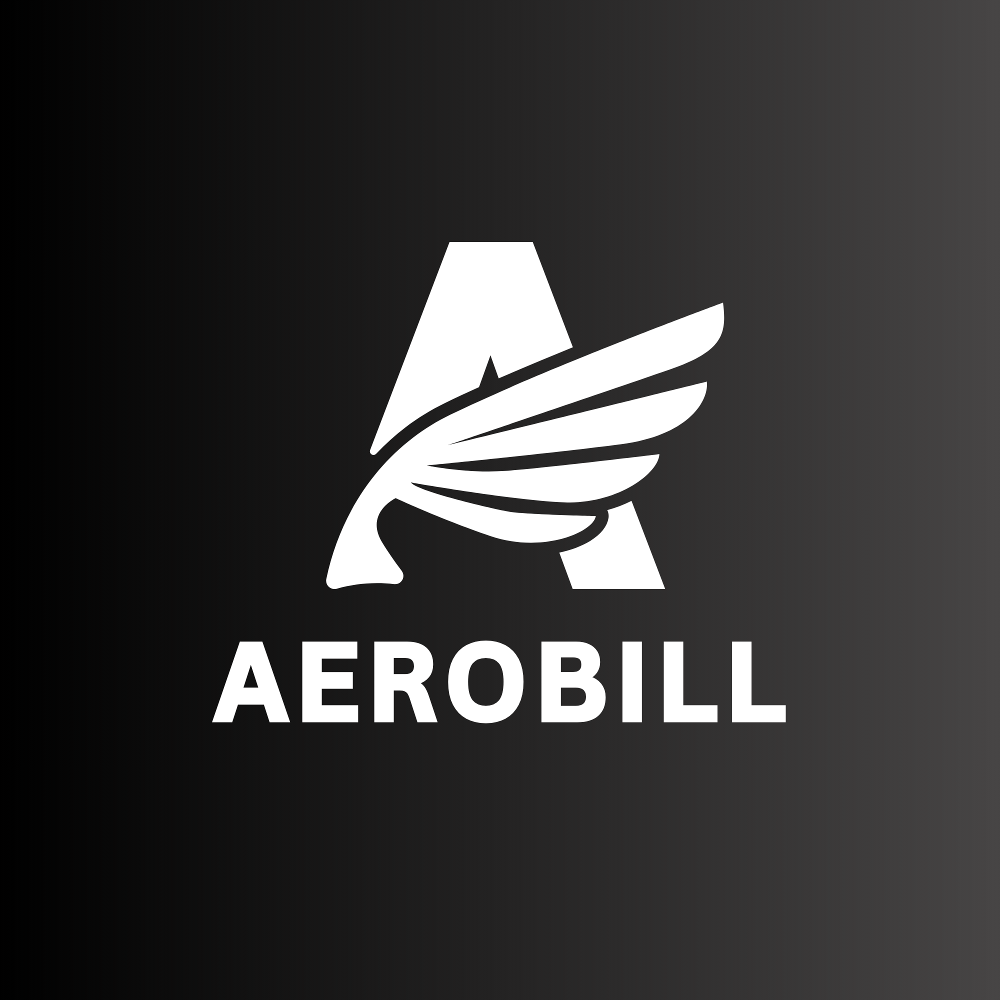

<p align="center">
  
</p>

<h1 align="center">AeroBill</h1>

<p align="center">
  <strong>Your 100% Offline Billing Partner</strong><br/>
  Create professional invoices in seconds — no internet, no subscriptions, no data leaving your device.
</p>

<p align="center">
  
  
  
  
  
</p>

---

## ✨ What is AeroBill?

AeroBill is a **fully offline, privacy-first invoicing app** built with React Native and Expo. It is designed for freelancers, small business owners, and traders who need a fast, professional, and secure way to create and manage invoices — without any cloud dependency or subscription fees.

> **All data is stored locally on your device using SQLite. Nothing ever leaves your phone.**

---

## 🚀 Features

| Feature | Description |
|---|---|
| 📄 **Invoice Wizard** | Step-by-step invoice creation with customer selection, line items, tax, and notes |
| 🏢 **Business Profile** | Configure your business name, address, logo, GSTIN, and digital signature |
| 👥 **Customer Management** | Create and manage a customer directory with name, phone, email, and address |
| 📦 **Product Catalogue** | Save products/services with default price, SKU, and unit for quick reuse |
| 🖨️ **PDF Generation & Sharing** | Generate professional PDF invoices and share or download them directly |
| 📊 **Dashboard Analytics** | At-a-glance stats — total invoiced, this month's revenue, and invoice count |
| 🌗 **Light / Dark Theme** | Full light and dark mode support, persisted across sessions |
| 💾 **Backup & Restore** | Export your entire database as a JSON file and restore it anytime |
| 📁 **Custom Download Folder** | Pick a persistent folder once; invoices download silently every time |
| 💱 **Multi-Currency Support** | Set your preferred currency symbol (₹, $, €, etc.) |
| 🔒 **100% Offline & Private** | Sandboxed SQLite storage — zero network requests, zero telemetry |

---

## 🛠️ Tech Stack

| Layer | Technology |
|---|---|
| Framework | [React Native](https://reactnative.dev/) 0.85.3 + [Expo](https://expo.dev/) SDK 56 |
| Language | TypeScript 6.0 |
| Navigation | React Navigation v7 (Stack + Bottom Tabs) |
| State Management | [Zustand](https://github.com/pmndrs/zustand) v5 |
| Local Database | [expo-sqlite](https://docs.expo.dev/versions/latest/sdk/sqlite/) with schema migrations |
| PDF Generation | [expo-print](https://docs.expo.dev/versions/latest/sdk/print/) + [expo-sharing](https://docs.expo.dev/versions/latest/sdk/sharing/) |
| File System | [expo-file-system](https://docs.expo.dev/versions/latest/sdk/filesystem/) + [expo-document-picker](https://docs.expo.dev/versions/latest/sdk/document-picker/) |
| Image Handling | [expo-image-picker](https://docs.expo.dev/versions/latest/sdk/imagepicker/) + [expo-image-manipulator](https://docs.expo.dev/versions/latest/sdk/imagemanipulator/) |
| Signatures | [react-native-signature-canvas](https://github.com/YanYuanFE/react-native-signature-canvas) |
| List Performance | [@shopify/flash-list](https://shopify.github.io/flash-list/) |
| Icons | [@expo/vector-icons](https://docs.expo.dev/guides/icons/) (Ionicons) |
| Date Handling | [dayjs](https://day.js.org/) |

---

## 📱 App Structure

```
AeroBill/
├── App.tsx                  # Entry point — DB init, theme, navigation bootstrap
├── index.ts                 # Expo app registration
├── app.json                 # Expo config
├── assets/                  # App icons, splash images
└── src/
    ├── components/          # Reusable UI atoms and molecules
    ├── db/
    │   ├── DBClient.ts      # SQLite singleton + migration runner
    │   └── repositories/    # Data access layer (Invoice, Customer, Product, Business)
    ├── hooks/               # Custom hooks (useTheme, etc.)
    ├── navigation/          # Root navigator + tab/stack configs
    ├── screens/
    │   ├── home/            # Dashboard with stats and recent invoices
    │   ├── invoice/         # Multi-step invoice wizard + history + detail view
    │   ├── customers/       # Customer list and editor
    │   ├── products/        # Product catalogue
    │   └── settings/        # Business config, appearance, backup, download folder
    ├── services/            # PDF generation, backup/restore logic
    ├── stores/              # Zustand stores (settings, theme, invoice draft)
    ├── styles/              # Global theme tokens (colors, typography, spacing)
    └── types/               # Shared TypeScript type definitions
```

---

## 🗄️ Database Schema

AeroBill uses **expo-sqlite** with a versioned migration system (`PRAGMA user_version`). The schema includes:

- **`businesses`** — Single-row business profile (name, address, logo, signature, tax rate, currency, invoice prefix, theme)
- **`customers`** — Customer directory with soft-archive support
- **`products`** — Product/service catalogue with SKU and unit
- **`invoices`** — Invoice records with customer and business snapshots (immutable at time of creation)
- **`invoice_items`** — Line items linked to each invoice

> Snapshots are used for customers and businesses so that editing a customer/business profile never retroactively changes old invoices.

---

## ⚙️ Getting Started

### Prerequisites

- [Node.js](https://nodejs.org/) 18+
- [Expo CLI](https://docs.expo.dev/get-started/installation/) — `npm install -g expo-cli`
- Android Studio (for Android) or Xcode (for iOS)

### Installation

```bash
# 1. Clone the repository
git clone https://github.com/imAkshat7/AeroBill.git
cd AeroBill

# 2. Install dependencies
npm install

# 3. Start the Expo development server
npm start
```

### Running on a Device

```bash
# Android
npm run android

# iOS (macOS only)
npm run ios

# Web (experimental)
npm run web
```

> **Note:** For Android, make sure you have an emulator running or a physical device connected via ADB.

---

## 🏗️ Building for Production

AeroBill uses [EAS Build](https://docs.expo.dev/build/introduction/) for production builds.

```bash
# Install EAS CLI
npm install -g eas-cli

# Log in to your Expo account
eas login

# Build for Android (APK or AAB)
eas build --platform android

# Build for iOS
eas build --platform ios
```

---

## 🔐 Privacy

AeroBill is designed with **privacy by default**:

- ✅ No user accounts or sign-ups required
- ✅ No analytics, no tracking, no telemetry
- ✅ No network requests — the app works fully offline
- ✅ All data is sandboxed in the device's local SQLite database
- ✅ Backup/restore is entirely in the user's hands (local JSON file)

---

## 🤝 Contributing

Contributions are welcome! To get started:

1. Fork the repository
2. Create a feature branch: `git checkout -b feature/your-feature-name`
3. Commit your changes: `git commit -m "feat: add your feature"`
4. Push to your branch: `git push origin feature/your-feature-name`
5. Open a Pull Request

Please follow the existing code style (ESLint + Prettier configs are included).

---

## 📄 License

This project is licensed under the **MIT License** — see the [LICENSE](./LICENSE) file for details.

---

<p align="center">
  Made with ❤️ · AeroBill v1.0.0 · 100% Offline · Secure Sandboxed Data
</p>
